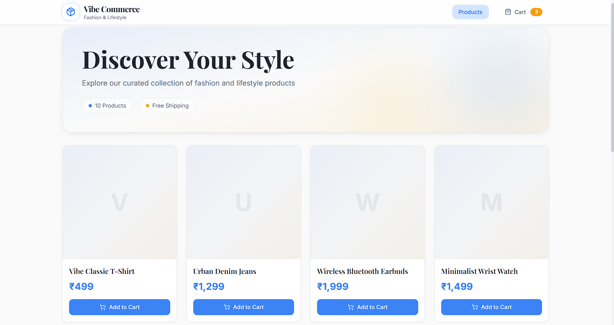
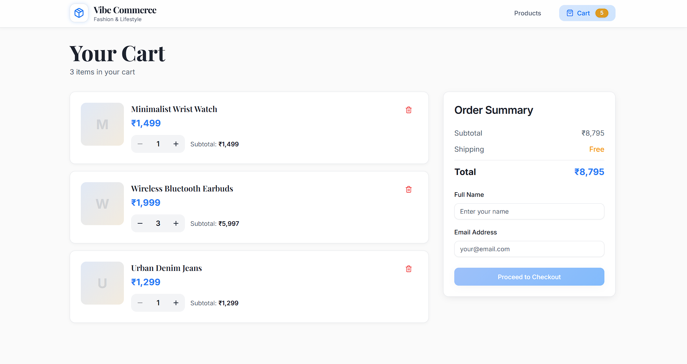
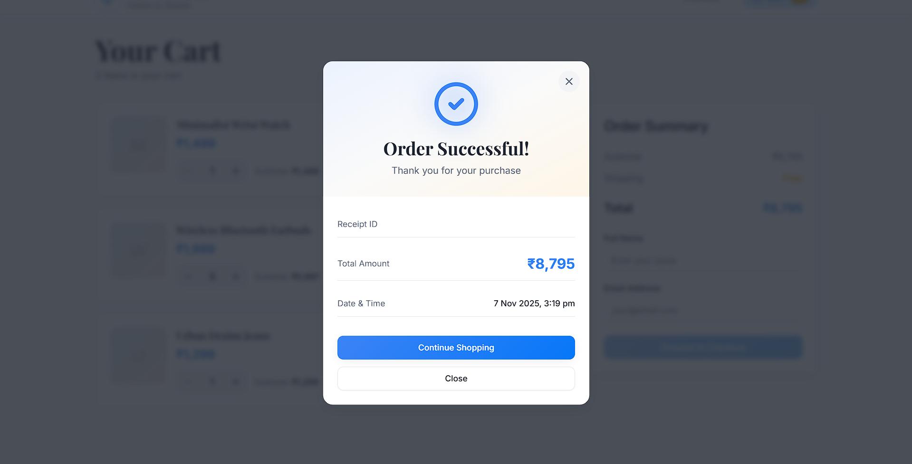

# 🛒 Mock E-Com Cart"# Mock E-Commerce Cart Application


A modern, full-stack e-commerce cart application built with React and Node.js. This project demonstrates building a responsive shopping interface with real-time cart management, state persistence, and mock checkout flow.A full-stack shopping cart application built with React (Vite) and Node.js/Express, featuring product listing, cart management, and mock checkout functionality.


## 🚀 Features



- Product listing with add to cart functionality

- Cart management (add, remove, update quantity)

## ✨ Key Features- Mock checkout process with receipt generation

- Responsive design with Tailwind CSS and Framer Motion animations

- **Product Catalog**: Responsive grid layout with add-to-cart functionality- REST API backend with MongoDB/In-memory storage

- **Cart Management**: Real-time updates, quantity controls, item removal- Optimistic concurrency control for cart operations

- **Checkout Process**: Form validation, mock payment, receipt generation- Comprehensive error handling and recovery

- **Responsive Design**: Mobile-first UI with smooth animations- Unit and integration tests

- **Data Persistence**: MongoDB integration with in-memory fallback

- **Error Handling**: Comprehensive error states and user feedback## 📋 Prerequisites


## 🛠️ Tech Stack- Node.js >= 14.x

- npm >= 6.x

### Frontend- MongoDB (optional)

- **Framework**: React 18 with Vite

- **State Management**: React Context API## 🛠️ Installation

- **Styling**: Tailwind CSS + Shadcn/UI components

- **Animations**: Framer Motion### Backend Setup

- **HTTP Client**: Axios

- **Icons**: Lucide Icons```bash

cd backend

### Backendnpm install

- **Runtime**: Node.js with Express

- **Database**: MongoDB with Mongoose ODM# Create .env file with:

- **Architecture**: MVC pattern with RESTful APIsPORT=3000

- **Persistence**: Dual-mode (MongoDB/In-memory)MONGO_URL=mongodb://localhost:27017/mock-ecom (optional)


## 🔌 API Endpoints# Run tests

npm test

### Products

```http# Start development server

GET /api/productsnpm run dev

``````

Returns array of products with `id`, `name`, and `price`.

### Frontend Setup

### Cart

```http```bash

GET /api/cartcd frontend

POST /api/cart         # body: { productId, qty }npm install

DELETE /api/cart/:id

```# Create .env file with:

Manages cart state with optimistic updates and version control.VITE_API_URL=http://localhost:3000


### Checkout# Start development server

```httpnpm run dev

POST /api/checkout     # body: { cartItems }```

```

Processes order and returns receipt with `total` and `timestamp`.## 🔌 API Documentation


## 🚀 Getting Started### Products API


### Prerequisites#### GET /api/products

- Node.js >= 14.xReturns list of available products.

- npm >= 6.x

- MongoDB (optional)Response:

```json

### Installation[

  {

1. Clone the repository:    "id": "string",

   ```bash    "name": "string",

   git clone https://github.com/AnveshSrivastava/mock-ecom-cart.git    "price": "number"

   cd mock-ecom-cart  }

   ```]

```

2. Install dependencies:

   ```bash### Cart API

   # Backend

   cd backend#### GET /api/cart

   npm installReturns current cart items and total.


   # FrontendResponse:

   cd ../frontend```json

   npm install{

   ```  "items": [

    {

3. Environment Setup:      "id": "string",

   ```bash      "productId": "string",

   # Backend (.env)      "name": "string",

   MONGO_URI=mongodb://localhost:27017/mock-ecom      "price": "number",

   PORT=4000      "qty": "number",

      "lineTotal": "number"

   # Frontend (.env)    }

   VITE_API_URL=http://localhost:4000  ],

   ```  "total": "number"

}

4. Start the development servers:```

   ```bash

   # Backend#### POST /api/cart

   cd backendAdd/update cart item.

   npm run dev

Request:

   # Frontend (new terminal)```json

   cd frontend{

   npm run dev  "productId": "string",

   ```  "qty": "number"

}

5. Visit:```

   - Frontend: [http://localhost:5173](http://localhost:5173)

   - API: [http://localhost:4000/api/products](http://localhost:4000/api/products)#### DELETE /api/cart/:id

Remove item from cart.

## 🏗️ Architecture

### Checkout API

### Frontend Structure

```#### POST /api/checkout

frontend/Process checkout and generate receipt.

├── src/

│   ├── components/   # Reusable UI componentsRequest:

│   ├── pages/       # Route components```json

│   ├── context/     # Global state management{

│   ├── api/         # API integration  "cartItems": [

│   └── utils/       # Helper functions    {

```      "productId": "string",

      "qty": "number"

### Backend Structure    }

```  ]

backend/}

├── src/```

│   ├── controllers/ # Request handlers

│   ├── models/     # Data modelsResponse:

│   ├── routes/     # API routes```json

│   ├── db/        # Database configuration{

│   └── middleware/ # Express middleware  "receiptId": "string",

```  "total": "number",

  "timestamp": "string"

## 🧪 Testing API Endpoints}

```

### Using Postman/Insomnia

1. Import the provided collection: `docs/mock-ecom.postman.json`## 🧪 Testing

2. Set environment variable: `baseUrl=http://localhost:4000`

The project includes comprehensive test coverage for both backend and frontend:

### Example Requests

```bash### Backend Tests

# Get all products- Unit tests for models

curl http://localhost:4000/api/products- Integration tests for API endpoints

- Concurrency testing for cart operations

# Add item to cart- Edge case handling tests

curl -X POST http://localhost:4000/api/cart \

  -H "Content-Type: application/json" \Run tests with:

  -d '{"productId":"123","qty":1}'```bash

```cd backend

npm test

## 🔒 Error Handling```


- **Frontend**:### Frontend Tests

  - Loading states for async operations- Component testing with React Testing Library

  - Toast notifications for user feedback- API integration tests

  - Form validation with error messages- UI interaction tests

  - Network error recovery

Run tests with:

- **Backend**:```bash

  - Validation middleware for requestscd frontend

  - Error handling middlewarenpm test

  - Database connection fallback```

  - Concurrent update protection

## 🔒 Error Handling

## 🎯 Future Improvements

The application implements comprehensive error handling:

- [ ] User authentication & session management

- [ ] Product categories and search1. API Errors:

- [ ] Real payment gateway integration   - Input validation

- [ ] Order history   - Product availability checks

- [ ] Admin dashboard   - Quantity validation

- [ ] E2E tests with Cypress   - Network error recovery

- [ ] CI/CD pipeline setup   - Concurrency control


## 👨‍💻 Author2. Frontend Error Handling:

   - API error toasts

**Anvesh Srivastava**   - Loading states

- GitHub: [@AnveshSrivastava](https://github.com/AnveshSrivastava)   - Network error recovery

- LinkedIn: [Anvesh Srivastava](https://linkedin.com/in/anveshsrivastava)   - Form validation


## 📄 License## 💾 Data Persistence


This project is open source and available under the [MIT License](LICENSE).The application supports two storage modes:

1. MongoDB (Recommended):
   - Set MONGO_URL in backend .env
   - Persistent across server restarts
   - Optimistic concurrency control
   - Atomic operations

2. In-Memory (Fallback):
   - Automatic fallback if MongoDB unavailable
   - Data persists until server restart
   - Simulated concurrency control
   - Suitable for development/testing

## 🏗️ Project Structure

```
/mock-ecom-cart
├── /backend
│   ├── /src
│   │   ├── /controllers    # Request handlers
│   │   ├── /models         # Data models
│   │   ├── /middleware     # Express middleware
│   │   └── /db            # Database connection
│   └── /tests              # Backend tests
├── /frontend
│   ├── /src
│   │   ├── /api           # API client
│   │   ├── /components    # React components
│   │   ├── /pages         # Route pages
│   │   └── /utils         # Helper functions
│   └── /tests             # Frontend tests
```

## 🔄 State Management

- Server: MongoDB/In-memory store with optimistic concurrency
- Frontend: React Context for cart state
- API: RESTful endpoints with proper error handling

## 🚦 Known Limitations

1. No user authentication/sessions
2. In-memory mode loses data on server restart
3. No real payment processing
4. Limited product metadata

## 🛣️ Future Improvements

1. User authentication
2. Session persistence
3. Real payment integration
4. Product categories and search
5. Order history
6. E2E testing with Cypress" 
